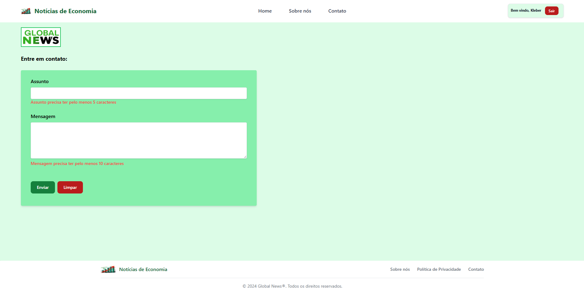

## Aplicação web de notícias de economia

Trata-se de um aplicativo web sobre notícias de economia com as seguintes características:
- o aplicativo está em produção no site https://noticiaseconomia.vercel.app/;
- para consultar as notícias, o usuário deve se registrar e/ou efetuar login;
- o usuário pode inserir comentários no final de cada notícia;
- o usuário pode alterar ou excluir os seus comentários; e
- existe uma página de contato para o usuário enviar dúvidas, críticas ou sugestões.

Do ponto de vista técnico, o aplicativo possui as seguintes características:
- foi desenvolvido utilizando o framework NextJS;
- a estilização dos componentes foi realizada por meio da biblioteca Tailwind CSS;
- o sistema de registro e login utiliza o recurso Authentication do Google Firebase. O nome do usuário é salvo no banco de dados Firestore do Google Firebase;
- os comentários dos usuários ao final de cada notícia e os dados enviados na tela de contato são salvos no banco de dados Firestore do Google Firebase;
- os campos de login, registro, recuperar senha e contato possuem validação;
- a tela Home, que contém a lista das notícias, possui paginação para mostrar no máximo 10 notícias por página;
- as notícias são salvas em arquivos markdown e carregadas automaticamente pela aplicação; e
- as rotas referentes à tela Home, às notícias individuais e à tela de Contato são protegidas e só podem ser acessadas por usuários autenticados.

As telas a seguir exibem a aplicação em produção:

1. Página de login

2. Página de registro

3. Página de recuperar senha

4. Página Home

5. Página contendo uma notícia

6. Componente para inserir comentários ao final de cada notícia

7. Página Sobre Nós

8. Página Contato

9. Página Política de Privacidade

10. Página Política de Comentários

